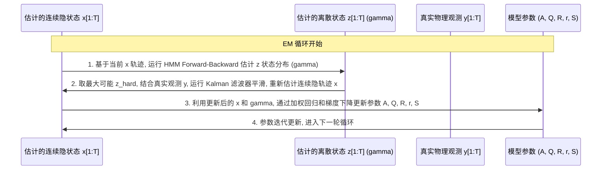

# 模型原理解析与关联说明 (Model Explanation & Step Correlation)

本文件详细阐述了本项目中涉及的两个核心模型：**rAR-HMM** (模型 1) 与 **rSLDS** (模型 2) 的定义，并剖析了它们在**前向生成 (Simulation)** 与 **参数推断 (EM/VI 训练)** 时，前一步与后一步之间的关联机制。

---

## 1. 两个模型的定义与区别

| 维度 | 模型 1: rAR-HMM (循环自回归隐马尔可夫模型) | 模型 2: rSLDS (循环切换线性动力学系统) |
| :--- | :--- | :--- |
| **连续状态 $x_t$** | **完全可观测** (例如：直接测量单摆的真实角度 $\theta_t$ 和角速度 $\omega_t$)。 | **隐变量 (Latent Variable)** (无法直接获得真实物理状态，需要推断)。 |
| **观测变量 $y_t$** | 无需额外观测层，观测即为 $x_t$。 | **不完全/带噪观测** (例如：只能测得带噪角度 $\theta_t$，即 $y_t = C x_t + v_t$)。 |
| **离散状态 $z_t$** | 隐变量，代表物理运动的“分区/模态”（例如：小幅摆动、旋转等）。 | 隐变量，代表控制隐状态转移的“分区/模态”。 |
| **应用场景** | 适用于传感器数据质量极高、物理状态无遮挡且无噪声的场景。 | 适用于观测不全（缺维度）、带严重测量噪声或传感器受限的实际场景。 |

---

## 2. 动力学前向生成：前一步与后一步的关联

在两个模型中，系统在时间步 $t \to t+1$ 的推进过程都将**连续状态**与**离散状态**紧密耦合在一起。以下是生成一步的详细链条：

### 2.1 状态转移的序列关联 (Step-by-step Coupling)

```mermaid
graph LR
    xt["当前连续状态 x_t"] -->|1. 影响转移概率| z_next["下一时刻离散状态 z_{t+1}"]
    z_next -->|2. 选择动力学参数| xt_next["下一时刻连续状态 x_{t+1}"]
    xt_next -->|3. (仅rSLDS) 映射观测| yt_next["下一时刻物理观测 y_{t+1}"]
```

### 2.2 详细数学关联步骤

1. **第一步：连续状态决定离散转移概率 ($x_t \to z_{t+1}$)**
   系统的当前连续物理状态 $x_t$ 决定了下一步系统进入哪个离散模态 $z_{t+1}$。这通过 **Stick-Breaking 逻辑回归** (Recurrence Transition) 实现：
   * 计算对数几率 (logits) 向量：
     $$\nu_{t+1} = R_{z_t} x_t + r_{z_t} \in \mathbb{R}^{K-1}$$
     *(其中 $R, r$ 为循环转移矩阵和偏置。若为 `ro` 模式，所有状态共享一套参数，即偏置只由 $x_t$ 决定)*
   * 通过 Stick-Breaking 映射转为类别概率：
     $$\pi_{t+1} = \text{StickBreaking}(\nu_{t+1})$$
   * 从中采样下一时刻的离散模态：
     $$z_{t+1} \sim \text{Categorical}(\pi_{t+1})$$
   
   > **物理关联直观理解**：以单摆为例，当前摆动到最高点（$x_t$ 中的速度 $\omega \approx 0$）决定了系统接下来大概率维持在“小摆动”模态；而如果当前具有极高角速度，系统则会转移到“旋转”模态。

2. **第二步：离散模态决定连续状态动力学 ($z_{t+1} \to x_{t+1}$)**
   采样出的离散模态 $z_{t+1}$ 作为开关，决定了这一步系统使用哪套自回归参数 (AR Dynamics) 来生成下一个连续状态 $x_{t+1}$：
   * 选择对应的自回归系数 $A_{z_{t+1}}$ 和噪声协方差 $Q_{z_{t+1}}$：
     $$x_{t+1} = A_{z_{t+1}} \tilde{x}_t + e_t, \qquad e_t \sim \mathcal{N}(0, Q_{z_{t+1}})$$
     *(其中 $\tilde{x}_t = [x_t; x_{t-1}; \dots; 1]$ 是拼接了滞后项和偏置项的输入特征)*

3. **第三步：(仅限模型 2 - rSLDS) 连续隐状态映射到物理观测 ($x_{t+1} \to y_{t+1}$)**
   由于模型 2 的连续状态 $x_{t+1}$ 是隐变量，外界无法直接观测，因此需要通过观测矩阵 $C$ 和观测噪声协方差 $S$ 投射出实际观测值 $y_{t+1}$：
   $$y_{t+1} = C x_{t+1} + v_{t+1}, \qquad v_{t+1} \sim \mathcal{N}(0, S)$$

---

## 3. 推断与训练算法：前一步与后一步的迭代关联

在训练模型时（即给定观测数据，求解最优参数 $\Theta$ 时），前一步的计算结果直接构成后一步的输入。

### 3.1 模型 1 (rAR-HMM) 的 EM 迭代关联

rAR-HMM 采用**期望最大化 (EM)** 算法，其 E 步和 M 步紧密相扣：
* **前一步 (E-step)：计算状态归属概率 (Responsibilities)**
  基于当前的连续观测轨迹 $x_{1:T}$ 和当前模型参数 $\Theta^{(it)}$，运行 **HMM Forward-Backward** 算法。
  * **输入**：$x_{1:T}$
  * **输出**：后验状态归属概率 $\gamma_t(k) = p(z_t = k \mid x_{1:T})$。
* **后一步 (M-step)：更新模型参数**
  * **关联**：将前一步计算出的 $\gamma_t(k)$ 作为样本权重，执行加权最小二乘法 (Weighted Least Squares) 来更新自回归参数 $A_k, Q_k$；并用梯度下降法更新转移参数 $R, r$。
  * 得到更新后的参数 $\Theta^{(it+1)}$，供下一轮 E 步使用。

---

### 3.2 模型 2 (rSLDS) 的 EM 迭代关联 (双重隐变量的解耦)

模型 2 (rSLDS) 的推断更具挑战性，因为**连续状态 $x_{1:T}$ 和离散状态 $z_{1:T}$ 都是隐变量**。算法必须交替更新这两个隐变量：



1. **第一步 (E-step Part 1 - 离散状态推断)**：
   假设当前的连续隐轨迹估计 $x_{1:T}$ 是准确的。我们在这个 $x_{1:T}$ 上执行 **HMM Forward-Backward**，计算每个时间步的离散模态概率 $\gamma_t(k) = p(z_t = k \mid x_{1:T})$。
   
2. **第二步 (E-step Part 2 - 连续状态推断 - 关键关联)**：
   这是将两个隐变量串联的关键。我们提取上一小步算出的离散概率，通过 Hard Assignment（即 $z_t = \arg\max_k \gamma_t(k)$）确定每个时刻系统所处的模态。
   * **输入**：真实带噪观测 $y_{1:T}$，以及对应的离散序列 $z_{1:T}$。
   * **计算**：运行 **卡尔曼平滑器 (Kalman Smoother)**。卡尔曼平滑器会根据序列 $z_t$ 指示的动力学参数 $A_{z_t}, Q_{z_t}$，从物理观测 $y_{1:T}$ 中过滤并补全出最符合物理规律的连续状态 $x_{1:T}$。
   * **输出**：更新后的连续隐轨迹 $x_{1:T}$。
   
3. **第三步 (M-step - 参数更新)**：
   使用刚刚更新的连续隐状态 $x_{1:T}$ 和离散概率 $\gamma_t(k)$，像 rAR-HMM 一样更新参数：
   * 更新动力学参数 $A_k, Q_k$
   * 更新逻辑回归转移系数 $R, r$
   * 更新观测噪声 $S$：通过隐状态 $x_t$ 与真实观测 $y_t$ 的偏差来计算新的测量误差。

---

## 4. 总结：系统级反馈闭环

两个模型的科学本质在于：**物理状态驱动了运动模态的切换，而运动模态又反过来规定了物理状态的下一步演化。**

* **前向模拟时**：
  $$x_t \xrightarrow{\text{Recurrence }(R, r)} z_{t+1} \xrightarrow{\text{Dynamics }(A, Q)} x_{t+1}$$
* **参数训练时**：
  $$\text{隐状态 } x_{1:T} \xrightarrow{\text{HMM F-B}} \text{离散权重 } \gamma_t \xrightarrow{\text{Kalman Smoother}} \text{更新后的 } x_{1:T}$$

这种“前一步作为后一步的输入条件，后一步作为前一步的校正反馈”的闭环，正是循环切换动力学模型的核心魅力与数学美感所在。
